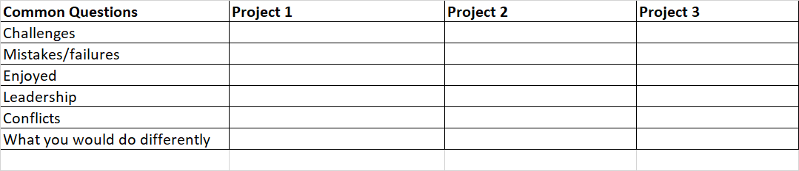

Algorithms

- Big O notation / logarithm (and why it is faster)
- Traversal: Graph, Tree, Matrix (DFS/BFS)
- Binary Search (logarithm time complexity: faster than linear): used for searching sorted values
- Two pointer mechanism
- Recursion
- Inverting a binary tree and reversing LinkedIn List
- Suffix Trees
- Heaps (Binary Heaps, Min and Max Heaps): they have log time complexity
- Dynamic Programming
- Quick Sort and Merge Sort 

Avoid these: 
- Over-communicating: If you need to take time to think through the problem, ask for it (say: give me 20 - 60 secs to think about this). this is better than rambling
- List bunch of DS without explaining why and what they would do.
- Jumping into the coding without giving thought to how you will code the solution.
- Not confirming the inputs to problem statements matches what the interviewer expects

### Web Resources
- https://cheonhyangzhang.gitbooks.io/leetcode-solutions/content/ (leetcode solutions)
- https://github.com/YaokaiYang-assaultmaster/LeetCode/tree/master/LeetcodeAlgorithmQuestions
- https://leetcode.com/discuss/study-guide/1800120/become-master-in-linked-list (linkedList)
- https://leetcode.com/discuss/study-guide/1733447/Become-Master-In-Recursion (recursion)
- https://leetcode.com/discuss/study-guide/1747722/How-to-Solve-Dynamic-Programming-Problems-in-Coding-Interviews   
- https://leetcode.com/explore/learn/card/dynamic-programming/ (DP learning card)
- https://leetcode.com/explore/featured/card/heap/ (Heap learning card)
- https://leetcode.com/explore/featured/card/graph/ (Graph) 
- https://github.com/paultofunmi/every-programmer-should-know
- https://github.com/paultofunmi/Facebook-Interview-Coding
- https://github.com/paultofunmi/coding-interview-university
- https://github.com/paultofunmi/system-design-primer
- https://leetcode.com/discuss/interview-experience/433178/Amazon-or-SDE3-or-Dallas-or-Nov-2019

### Basics
- https://www.youtube.com/watch?v=tWVWeAqZ0WU (Graph Basics - freecodecamp - Alvin)
- https://www.youtube.com/watch?v=oBt53YbR9Kk (DP basics - Freecodecamp - Alvin)

### Videos
- https://www.youtube.com/watch?v=G0_I-ZF0S38&list=PLot-Xpze53leU0Ec0VkBhnf4npMRFiNcB (LinkedList playlist)
- https://www.youtube.com/watch?v=OnSn2XEQ4MY&list=PLot-Xpze53ldg4pN6PfzoJY7KsKcxF1jg (Tree playlist)
- https://www.youtube.com/playlist?list=PLot-Xpze53leNZQd0iINpD-MAhMOMzWvO (Binary Search playlist)
- https://www.youtube.com/watch?v=73r3KWiEvyk&list=PLot-Xpze53lcvx_tjrr_m2lgD2NsRHlNO&t=0s (DP playlist)
- https://www.youtube.com/watch?v=pfiQ_PS1g8E&list=PLot-Xpze53lf5C3HSjCnyFghlW0G1HHXo (Backtracking problems)  
- https://www.youtube.com/watch?v=Zq4upTEaQyM&list=PLiQ766zSC5jM2OKVr8sooOuGgZkvnOCTI (Dynamic Programming, Recursion, & Backtracking - Back to Back SWE)
- https://www.youtube.com/watch?v=YgzpqlF54lo&list=PLKQ5LYb497AZIZe9dBWy8GwLluVaMQVj0 (Think Like a programmer playlist)
- https://www.youtube.com/watch?v=U6-X_QOwPcs&list=PLU_sdQYzUj2keVENTP0a5rdykRSgg9Wp- (Nick White Leetcode solutions)
- https://www.youtube.com/watch?v=utDu3Q7Flrw&list=PLot-Xpze53ldBT_7QA8NVot219jFNr_GI (Neet Code Graph Solutions Leetcode)
- https://www.youtube.com/watch?v=EgI5nU9etnU&list=PLot-Xpze53ldBT_7QA8NVot219jFNr_GI&t=0s (Graph)

### Leetcode algorithm tags
- https://leetcode.com/tag/backtracking/
- https://leetcode.com/tag/matrix/
- https://leetcode.com/tag/array/
- https://leetcode.com/tag/dynamic-programming/

### Company Challenges
- https://app.codesignal.com/company-challenges/uber
- https://app.codesignal.com/company-challenges/codesignal

### Sample Facebook offer Journey 
- https://leetcode.com/discuss/interview-experience/1243797/amazon-sde-2-reject-google-l4-reject-facebook-e4-offer-my-journey

FAANG Candidates are evaluated based on: 
- Coding - How clean & structured is your code?  Could you write the code that you said you would write?  Did you cover the edge and base cases?  Are your variables and functions well-named? 
Data Structures & Algorithms - Could you come up with a suitable algorithm or data structure to solve the problem efficiently?  Could you analyze that solution in terms of time & space complexity and the trade-offs?  Did you demonstrate mastery of the data structures available and create your own data structures as necessary with private/public APIs?  Could you think critically to analyze various alternatives and compare brute force solutions versus more optimal solutions?

- Communication - Were you able to clarify the problem as needed, and then explain the solution?  Many software engineers will try to talk as they are coding, and the words come out as a jumble of stuttered "uhmm.... hold on... ah.... wait.... give me 2 seconds... oh... ,nevermind..."  Some engineers simply talk in a way that is too technical and incomprehensible "... then we increment the variable i by the variable j minus one and check if j is equal to k..."  The ability to communicate effectively is crucial because coding is a team sport at the end of the day.

- Speed & Efficiency - Unlike in the old days, tech companies have been trying to avoid "aha!" moments where candidates either know or don't know the answer.  It is far more favored for interviewers to ask questions that can build atop of itself (such as increasingly adding restrictions or pushing for faster time/space), so that interviewers can get some signal on the candidate's ability beyond just "pass" or "no pass."  This is why fluidity & confidence is essential.  So, even if you may have heard of some of these problems before once or twice, it really helps to become great at these and see how "the pros" solve these problems to help you recognize patterns in code and in crafting elegant & simple solutions.

## Djikstra Algorithm
- Init distance of start vertex from start vertex to 0
- Init distance to all other vertices from start as infinity
While vertices remain unvisited 
  - Visit the unvisited vertex with the smallest known distance from start vertex (call this current vertext)
  - for each unvisited neighbour of the current vertex
    - calculate the distance from start vertex
    - if the calculated distance of this vertex is less than the known distance
      - update the shortest distance to this vertex
      - update the previous vertex with the current vertex
    - end if
  - Next unvisited neighbour  
  - Add the current vertex to the list of visited vertices
- END WHILE    

## Bellman Ford
- handles negative weight which Dijkstra can't because Dijkstra is greedy
- both bellman and dijkstra fail on graph with negative cycles.

## CTCT - Interview Preparation Grid
Go through each of the projects or components of your resume and ensure that you can talk about them in
detail. Filling out a grid like this may help:

### Answering behavioural and situational questions

